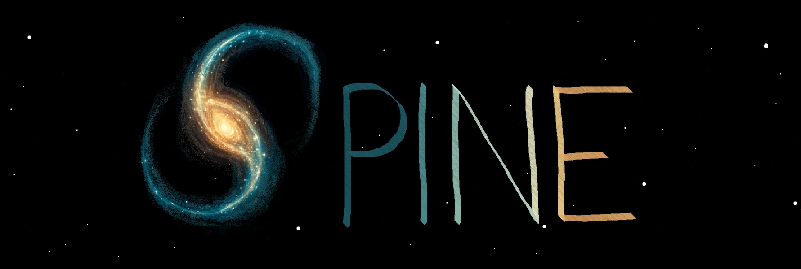

## Symbolic Power-spectrum INference Emulator 
### A symbolic model to predict the evolution of the ΛCDM nonlinear matter power spectrum

Emulators for the nonlinear matter power spectrum $P_{\mathrm{NL}}(k_{\mathrm{NL}})$ as a function of the linear matter power spectrum $P_{\mathrm{L}}(k_{\mathrm{L}})$ and cosmological parameters. We present two models to emulate $P_{\mathrm{NL}}(k_{\mathrm{NL}})$:

* <ins>SPINE </ins>: Predicting $P_{\mathrm{NL}}(k_{\mathrm{NL}})$ as a function of $P_{\mathrm{NL}}(k_{\mathrm{NL}})$ and $\theta = \left [h, \\; \Omega_m, \\; \Omega_b, \\; n_s, \\; \sigma_8, \\; n_L, \\; g_a \right]$ where
  - $h$ = Reduced Hubble's constant $\left(h = \frac{H_0}{100} \right)$
  - $\Omega_m$ = Matter density
  - $\Omega_b$ = Baryon density
  - $n_s$ = Scalar spectral index. Slope of the primordial power spectrum
  - $\sigma_8$ = Root-mean-square density fluctuation when the linearly evolved field is smoothed with a top-hat filter of radius 8 Mpc/h
  - $n_L$ = Slope of the late time power spectrum calculated as $\frac{dlnP}{dlnk}|_{k = k_L/2}$
  - $g_a$ = Growth suppression factor calculated as $g_a = \frac{D(a)}{a}$, where $D(a)$ is the linear growth factor and $a$ is the scale factor.

* <ins> SPINEX</ins>: Predicting $P_{\mathrm{NL}}(k_{\mathrm{NL}})$ as a function of $P_{\mathrm{NL}}(k_{\mathrm{NL}})$ and $\theta_X = \left [\omega_m, \\; f_b, \\; n_s, \\; \sigma_{12}, \\; n_L, \\; \widetilde{X} \right]$ where
   - $\omega_m$ = Physical matter density
   - $f_b$ = Baryon fraction calculated as $f_b = \frac{\Omega_b}{\Omega_m}$
   - $\sigma_{12}$ = Root-mean-square density fluctuation when the linearly evolved field is smoothed with a top-hat filter of radius 12 Mpc
   - $\widetilde{X}$ = Encodes information about the nonlinear evolution of the density field. See [Sanchez et al. 2025](https://doi.org/10.48550/arXiv.2511.13826) for more details.

# Installation

# Quickstart

# Citation
