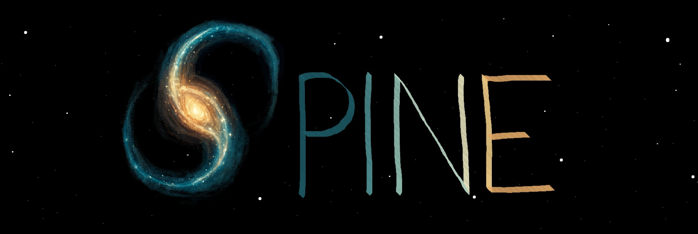

## Symbolic Power-spectrum INference Emulator 
### A symbolic model to predict the evolution of the ΛCDM nonlinear matter power spectrum

Emulators for the nonlinear matter power spectrum $P_{\mathrm{NL}}(k_{\mathrm{NL}})$ as a function of the linear matter power spectrum $P_{\mathrm{L}}(k_{\mathrm{L}})$ and cosmological parameters in the range $k = 0.01 - 2 \\; h \\; \mathrm{Mpc}^{-1}$ at $z=0$. We present two models to emulate $P_{\mathrm{NL}}(k_{\mathrm{NL}})$:

* ```spine```: Predicting $P_{\mathrm{NL}}(k_{\mathrm{NL}})$ as a function of $P_{\mathrm{L}}(k_{\mathrm{L}})$ and $\theta = \left [h, \\; \Omega_\mathrm{m}, \\; \Omega_\mathrm{b}, \\; n_\mathrm{s}, \\; \sigma_8, \\; n_\mathrm{L}, \\; g_\mathrm{a} \right]$

* ```spinex```: Predicting $P_{\mathrm{NL}}(k_{\mathrm{NL}})$ as a function of $P_{\mathrm{L}}(k_{\mathrm{L}})$ and $\theta_X = \left [\omega_\mathrm{m}, \\; f_\mathrm{b}, \\; n_\mathrm{s}, \\; \sigma_{12}, \\; n_\mathrm{L}, \\; \widetilde{x} \right]$

The parameter definitions are as follows

| Parameter | Name | Definition |
|--------|------|------------|
| $h$ | Reduced Hubble constant | $h = \dfrac{H_0}{100\ \mathrm{km\ s^{-1}\ Mpc^{-1}}}$ |
| $\Omega_\mathrm{m}$ | Matter density | Total matter density parameter |
| $\Omega_\mathrm{b}$ | Baryon density | Baryonic matter density parameter |
| $n_\mathrm{s}$ | Scalar spectral index | Slope of the primordial power spectrum |
| $\sigma_8$ | Density fluctuation amplitude | Root-mean-square density fluctuation when the linearly evolved field is smoothed with a top-hat filter of radius $8 \\; h^{-1} \\; \mathrm{Mpc}$ |
| $n_\mathrm{L}$ | Late-time power spectrum slope | $n_L = \frac{d\mathrm{ln}P}{d\mathrm{ln}k}$ for $k = \frac{k_\mathrm{L}}{2}$ |
| $g_\mathrm{a}$ | Growth suppression factor | $g_\mathrm{a} = \frac{D(a)}{a}$, where $D(a)$ is the linear growth factor and $a$ is the scale factor |
| $\omega_\mathrm{m}$ | Physical matter density | Physical matter density parameter |
| $f_\mathrm{b}$ | Baryon fraction | $f_\mathrm{b} = \frac{\omega_\mathrm{b}}{\omega_\mathrm{m}}$ |
| $\sigma_{12}$ | Density fluctuation amplitude | Root-mean-square density fluctuation when the linearly evolved field is smoothed with a top-hat filter of radius $12\mathrm{Mpc}$ |
| $\widetilde{x}$ | Nonlinear evolution parameter | Encodes information about the cosmological dependence of the nonlinear evolution of the density field. See [Sanchez et al. 2025](https://doi.org/10.48550/arXiv.2511.13826) for more details. |

The function ```emulate_pknl``` provides outputs for $P_{\mathrm{NL}}(k_{\mathrm{NL}})$ and a smoothed, no-Baryon-Acoustic-Oscillation (BAO), nonlinear power spectrum $P_{\mathrm{NL}}^{nw}(k_{\mathrm{NL}})$ for the 

This methodology provides simple Python equations for smoothed, no-BAO, dimensionless nonlinear power spectra $\Delta^2_{\mathrm{NL}}(k_{\mathrm{NL}})$. Users have the option to copy and adapt both equations into their preferred programming language. 

# Installation
To install the emulator and its dependencies, run

```
# Clone the repository
git clone https://github.com/skadoosh-MC/SPINE.git
cd SPINE

# Install in editable mode
pip install -e .
```

Come back here to check for an update on the ```spine``` Python package!

# Example
We have provided a working example in ```examples/spine_example.ipynb```. 

# Citation
If you use the SPINE emulators, please cite the following paper

```Chauhan et al. 2026 (submitted)```

This software is available under the MIT license.
